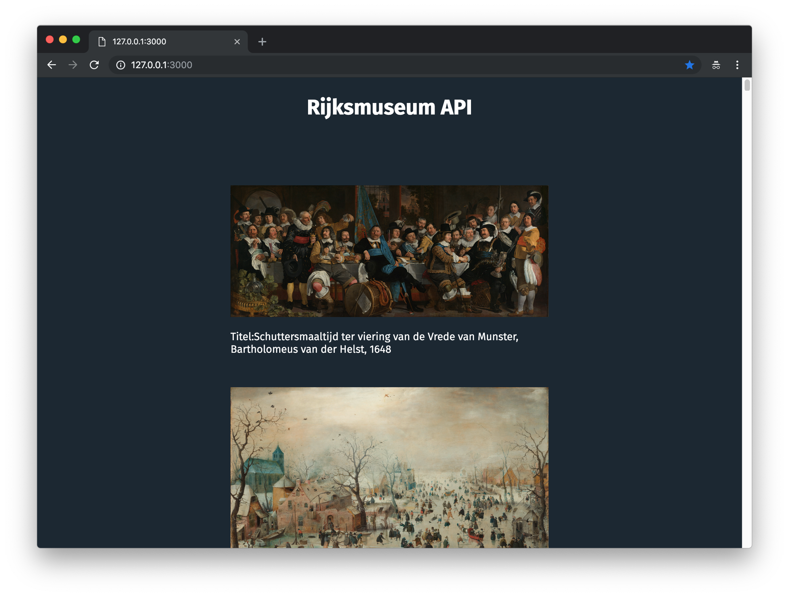

**Web App From Scratch @cmda-minor-web 18-19**

# Rijksmuseum API

This application shows data from the [Rijksmuseum API](https://rijksmuseum.github.io/). This API contains i.a. detailed information about the collection, including images and colors found in these images. The application now shows the first 100 **paintings** that contains the color with hex-code: [#737C84](https://www.google.com/search?q=%23737C84&oq=%23737C84&aqs=chrome..69i57.4556j0j7&sourceid=chrome&ie=UTF-8);

> "The Rijksmuseum OAI-PMH API provides access to more than **600,000 descriptions** of objects (metadata) and digital images from the Rijksmuseum collection and this number is still growing."



Check the live demo [here](https://sterrevangeest.github.io/web-app-from-scratch-18-19/week1/)!

<!-- ## Leerdoelen

- _Je kan structuur aanbrengen in je code door patterns toe te passen. Je kan de keuze voor de gekozen patterns beargumenteren_
- _Je kan data ophalen, manipuleren en dynamisch omzetten naar html elementen mbv templating._
- _Je begrijpt hoe je middels asynchrone code met een externe API kan werken._
- _Je begrijpt hoe je states in je applicaties kan managen en stelt de gebruiker op de hoogte van states waar nodig._ -->
<!--
[Rubric](https://docs.google.com/spreadsheets/d/e/2PACX-1vTjZGWGPC_RMvTMry8YW5XOM79GEIdgS7I5JlOe6OeeOUdmv7ok1s9jQhzojNE4AsyzgL-jJCbRj1LN/pubhtml?gid=0&single=true) -->

## Installing

```
git clone https://github.com/sterrevangeest/web-app-from-scratch-18-19.git

cd web-app-from-scratch-18-19/week1
```

## About the data

To retrieve the data from the API I used an `XMLHttpRequest`. Later I made a promise based `XMLHttpRequest`.

### `XMLHttpRequest` (XHR)

With an `XMLHttpRequest` you can retrieve any type of data from a URL (without having to do a full page refresh). You can see how I created this request [here](https://github.com/sterrevangeest/web-app-from-scratch-18-19/blob/master/week1/public/js/xml.js).

Source: [MDN](https://developer.mozilla.org/en-US/docs/Web/API/XMLHttpRequest/Using_XMLHttpRequest)

### Promise based XHR

When working with APIs, promises help avoid deeply nested callbacks, aka "Callback Hell". Promises allow you to chain methods together using `.then()`. You can see how I created an Promise based request [here](https://github.com/sterrevangeest/web-app-from-scratch-18-19/blob/master/week1/public/js/xmlPromise.js).

### Data structure

To access the data I used this URL: `https://www.rijksmuseum.nl/api/nl/collection?key=[API_KEY]&format=json&type=schilderij&ps=100&f.normalized32Colors.hex=%20%23737C84`

The response looks somewhat like this:

```json
{
  "elapsedMilliseconds": 164,
  "count": 359,
  "artObjects": [
    {
      "links": {
        "self": "https://www.rijksmuseum.nl/api/nl/collection/SK-C-5",
        "web": "https://www.rijksmuseum.nl/nl/collection/SK-C-5"
      },
      "id": "nl-SK-C-5",
      "objectNumber": "SK-C-5",
      "title": "Schutters van wijk II onder leiding van kapitein Frans Banninck Cocq, bekend als de ‘Nachtwacht’",
      "hasImage": true,
      "principalOrFirstMaker": "Rembrandt Harmensz. van Rijn",
      "longTitle": "Schutters van wijk II onder leiding van kapitein Frans Banninck Cocq, bekend als de ‘Nachtwacht’, Rembrandt Harmensz. van Rijn, 1642",
      "showImage": true,
      "permitDownload": true,
      "webImage": {
        "guid": "92253da1-794d-49f4-9e3c-e4c160715f53",
        "offsetPercentageX": 50,
        "offsetPercentageY": 100,
        "width": 2500,
        "height": 2034,
        "url": "http://lh6.ggpht.com/wwx2vAS9DzFmmyeZefPjMtmCNOdjD80gvkXJcylloy40SiZOhdLHVddEZLBHtymHu53TcvqJLYZfZF7M-uvoMmG_wSI=s0"
      },
      "headerImage": {
        "guid": "29a2a516-f1d2-4713-9cbd-7a4458026057",
        "offsetPercentageX": 50,
        "offsetPercentageY": 50,
        "width": 1920,
        "height": 460,
        "url": "http://lh5.ggpht.com/SgH3Qo-vYI8GGm7-b-Qt6lXgsCAIoU2VDRwO5LYSBVNhhbZCetcvc88ZPi518MTy0MHDrna4X4ZC1ymxVJVpzps8gqw=s0"
      },
      "productionPlaces": []
    }
    // more results...
  ]
}
```

For now I only use the keys `artObjects.longTitle` and `artObjects.WebImage.url`.

### Rendering data

I have tried two different ways for rendering the data:

1. With `document.createElement()` and `element.append()`, which you can see in [this file](https://github.com/sterrevangeest/web-app-from-scratch-18-19/blob/master/week1/public/js/xml.js).
2. With template literals with `.innerHTML`, whick you can find in [this file](https://github.com/sterrevangeest/web-app-from-scratch-18-19/blob/master/week1/public/js/xmlPromise.js)

## About Web App From Scratch

I working on this application during the Web App From Scratch course. During this course we focus on building a native HTML, CSS & JavaScript application, so no frameworks or unnecessary libraries.

### Planning

**Week 1** Hello API 🐒

[Repository | week 1](https://github.com/sterrevangeest/web-app-from-scratch-18-19/tree/master/week1)

- [x] During week 1 we focused on rendering data from an API.

**Week 2** - Design and Refactor 🛠

- [ ] Goal: Breakdown the web app. Add routes en states. Render a detailpage.

[Repository | week 2](https://github.com/sterrevangeest/web-app-from-scratch-18-19/tree/master/week2)

**Week 3**- Wrapping up 🎁

- [ ] Goal: Manipulate data, create modules and reflect the product.

[Repository | week 3](https://github.com/sterrevangeest/web-app-from-scratch-18-19/tree/master/week3)

<!-- Maybe a table of contents here? 📚 -->

<!-- How about a section that describes how to install this project? 🤓 -->

<!-- ...but how does one use this project? What are its features 🤔 -->

<!-- What external data source is featured in your project and what are its properties 🌠 -->

<!-- Maybe a checklist of done stuff and stuff still on your wishlist? ✅ -->

<!-- How about a license here? 📜 (or is it a licence?) 🤷 -->
