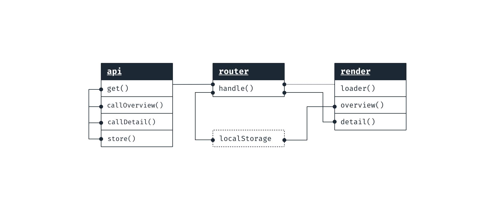
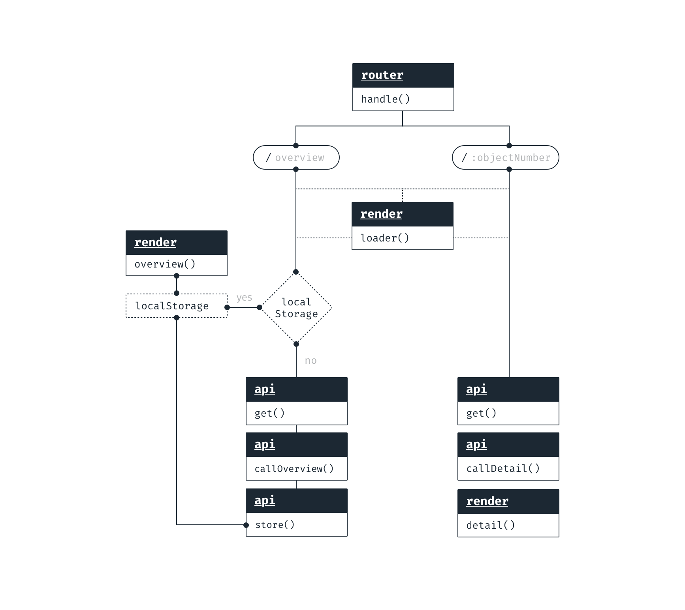
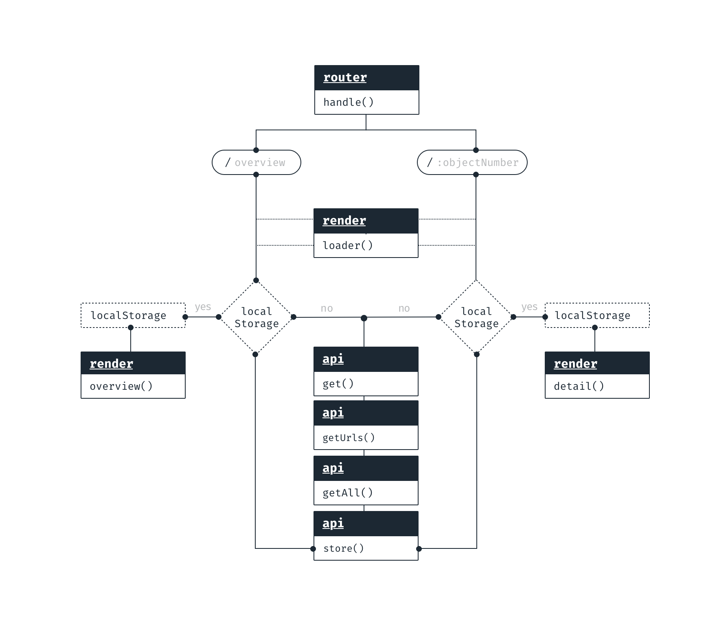

**Web App From Scratch @cmda-minor-web 18-19**

# Rijksmuseum API

This application shows data from the [Rijksmuseum API](https://rijksmuseum.github.io/). This API contains i.a. detailed information about the collection, including images and colors found in these images. The application now shows the first 100 results.

> "The Rijksmuseum OAI-PMH API provides access to more than **600,000 descriptions** of objects (metadata) and digital images from the Rijksmuseum collection and this number is still growing."


Check the live demo [here](https://sterrevangeest.github.io/web-app-from-scratch-18-19/week1/)!

## Installing

```
git clone https://github.com/sterrevangeest/web-app-from-scratch-18-19.git

cd web-app-from-scratch-18-19/week1
```

## About the data

### API request

To retrieve the data I have worked out different requests.

<details> <summary> XMLHttpRequest (XHR)</summary>

With an `XMLHttpRequest` you can retrieve any type of data from a URL (without having to do a full page refresh). You can see how I created this request [here](https://github.com/sterrevangeest/web-app-from-scratch-18-19/blob/master/week1/public/js/xml.js).

Source: [MDN](https://developer.mozilla.org/en-US/docs/Web/API/XMLHttpRequest/Using_XMLHttpRequest) </details> <details> <summary>Promise based XHR</summary>

When working with APIs, promises help avoid deeply nested callbacks, aka "Callback Hell". Promises allow you to chain methods together using `.then()`. You can see how I created an Promise based request [here](https://github.com/sterrevangeest/web-app-from-scratch-18-19/blob/master/week1/public/js/refactor.js).</details>

**Fetch**

I use a `fetch()` request now. Personally I think fetch is the most readable form
Fetch returns a promise with the HTTP response. To get the JSON from the response, I use the `json()` method.

### Data structure

The response looks somewhat like this:

```json
{
  "elapsedMilliseconds": 164,
  "count": 359,
  "artObjects": [
    {
      "links": {
        "self": "https://www.rijksmuseum.nl/api/nl/collection/SK-C-5",
        "web": "https://www.rijksmuseum.nl/nl/collection/SK-C-5"
      },
      "id": "nl-SK-C-5",
      "objectNumber": "SK-C-5",
      "title": "Schutters van wijk II onder leiding van kapitein Frans Banninck Cocq, bekend als de ‘Nachtwacht’",
      "hasImage": true,
      "principalOrFirstMaker": "Rembrandt Harmensz. van Rijn",
      "longTitle": "Schutters van wijk II onder leiding van kapitein Frans Banninck Cocq, bekend als de ‘Nachtwacht’, Rembrandt Harmensz. van Rijn, 1642",
      "showImage": true,
      "permitDownload": true,
      "webImage": {
        "guid": "92253da1-794d-49f4-9e3c-e4c160715f53",
        "offsetPercentageX": 50,
        "offsetPercentageY": 100,
        "width": 2500,
        "height": 2034,
        "url": "http://lh6.ggpht.com/wwx2vAS9DzFmmyeZefPjMtmCNOdjD80gvkXJcylloy40SiZOhdLHVddEZLBHtymHu53TcvqJLYZfZF7M-uvoMmG_wSI=s0"
      },
      "headerImage": {
        "guid": "29a2a516-f1d2-4713-9cbd-7a4458026057",
        "offsetPercentageX": 50,
        "offsetPercentageY": 50,
        "width": 1920,
        "height": 460,
        "url": "http://lh5.ggpht.com/SgH3Qo-vYI8GGm7-b-Qt6lXgsCAIoU2VDRwO5LYSBVNhhbZCetcvc88ZPi518MTy0MHDrna4X4ZC1ymxVJVpzps8gqw=s0"
      },
      "productionPlaces": []
    }
    // more results...
  ]
}
```

### Rendering data

I have tried two different ways for rendering the data:

1. With `document.createElement()` and `element.append()`, which you can see in [this file](https://github.com/sterrevangeest/web-app-from-scratch-18-19/blob/master/week1/public/js/xml.js). personally I think this way is "cleaner", but when you have to create lots of elements, the code will become less readable.

2. With template literals with `.innerHTML`, whick you can find in [this file](https://github.com/sterrevangeest/web-app-from-scratch-18-19/blob/master/week1/public/js/xmlPromise.js)

## The code

### Actor Diagram

The actor diagram shows **who** handles functionality in my application.



### Interaction Diagram

The interaction diagram shows **what** happens in the code.

This interaction diagram shows what happens right now.


 <details>
 <summary>This interaction diagram shows what I want my code to look like.</summary></details>

## To Do

- [x] Rendering dat from an API
- [x] Refactor code to Object Literals. See results [here](https://github.com/sterrevangeest/web-app-from-scratch-18-19/blob/master/week1/public/js/refactor.js)
- [x] Create a detail page, with Routie
- [ ] Add local storage to detail page
- [ ] Let users filter by color
- [ ] Create modules

## About Web App From Scratch

I'm working on this application during the Web App From Scratch course. During this course we focus on building a native HTML, CSS & JavaScript application, so no frameworks or unnecessary libraries.

<!-- Maybe a table of contents here? 📚 -->

<!-- How about a section that describes how to install this project? 🤓 -->

<!-- ...but how does one use this project? What are its features 🤔 -->

<!-- What external data source is featured in your project and what are its properties 🌠 -->

<!-- Maybe a checklist of done stuff and stuff still on your wishlist? ✅ -->

<!-- How about a license here? 📜 (or is it a licence?) 🤷 -->
