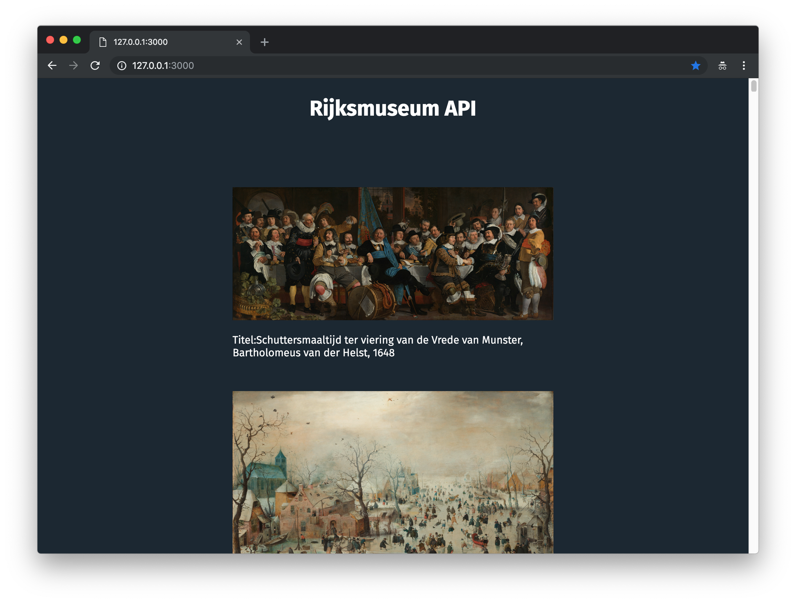

# Week 1 - Hello API 🐒

This application shows data from the [Rijksmuseum API](https://rijksmuseum.github.io/). This API contains i.a. detailed information about the collection, including images and colors found in these images. The application now shows the first 100 **paintings** that contains the color with hex-code: [#737C84](https://www.google.com/search?q=%23737C84&oq=%23737C84&aqs=chrome..69i57.4556j0j7&sourceid=chrome&ie=UTF-8);



## Installing

```
git clone https://github.com/sterrevangeest/web-app-from-scratch-18-19.git

cd web-app-from-scratch-18-19/week1
```

## Data

To retrieve the data from the API I used an `XMLHttpRequest`. Later I made a promise based `XMLHttpRequest`.

### `XMLHttpRequest` (XHR)

With an `XMLHttpRequest` you can retrieve any type of data from a URL (without having to do a full page refresh). You can see how I created this request [here](https://github.com/sterrevangeest/web-app-from-scratch-18-19/blob/master/week1/public/js/xml.js).

Source: [MDN](https://developer.mozilla.org/en-US/docs/Web/API/XMLHttpRequest/Using_XMLHttpRequest)

### Promise based XHR

When working with APIs, promises help avoid deeply nested callbacks, aka "Callback Hell". Promises allow you to chain methods together using `.then()`. You can see how I created an Promise based request [here](https://github.com/sterrevangeest/web-app-from-scratch-18-19/blob/master/week1/public/js/xmlPromise.js).

I also tried two different ways for rendering the data in the HTML:

1. With `document.createElement()` and `element.append()`, which you can see in [this file](https://github.com/sterrevangeest/web-app-from-scratch-18-19/blob/master/week1/public/js/xml.js)
2. With template literals, whick you can find in [this file](https://github.com/sterrevangeest/web-app-from-scratch-18-19/blob/master/week1/public/js/xmlPromise.js)
